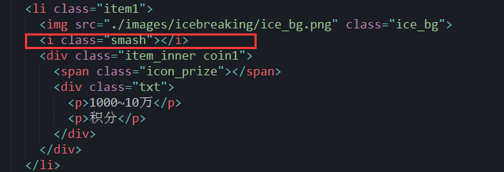
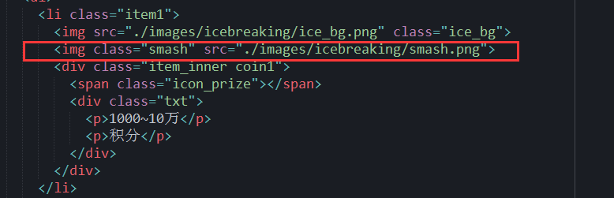
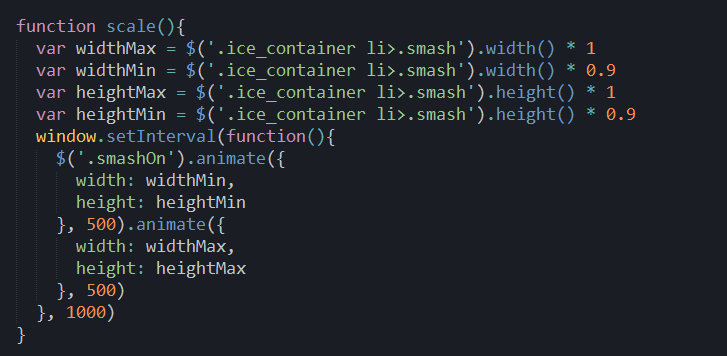
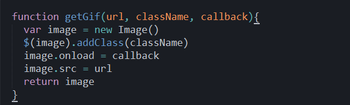
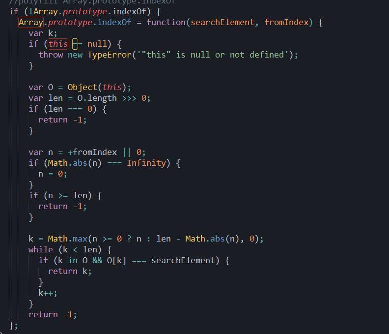

# ie7 兼容问题
1. 不支持 rem 单位，支持 px、em、precent

2. 不支持 background-position: center; 支持 background-position: 50% 50%;

3. 不支持 background-size: cover/contain; 支持 background-size: 100% 100%;

4. 使用 background-image: url(image-url); 让图片作为标签的背景，会出现一个bug，当你使用 js 控制标签变大或变小，背景图片并不会随着变大变小，因为 background-size 已经在 css 中定死了， 所以如果想做到变大、变小，除了改变标签的大小，还要去改变 background-size 的值，解决方法是直接使用  标签替代使用标签的方法
     

5. object.setAttribute("class","content") 在IE8、Chrome、火狐、Opera10中都能设置成功；但是在IE7下无法设置。 
object.setAttribute("className","content")只有IE7能设置成功，但是其他浏览器均无法设置。 
兼容方法：使用 object.className="content" 或者寻求 jQuery 的帮助

6. object.setAttribute("style","position:absolute;left:10px;top:10px;")在IE8、Chrome、火狐、Opera10中都能设置成功；但是在IE7下无法设置。 
object.setAttribute("cssText","position:absolute;left:10px;top:10px;")此设置方法，所有浏览器均不支持。 
兼容方法：使用 object.style.cssText="position:absolute;left:10px;top:10px;" 
或者单独 object.style.各个属性 ，逐一进行设置。

7. 不支持 Array.prototype.indexOf 方法，可以使用 ployfill
